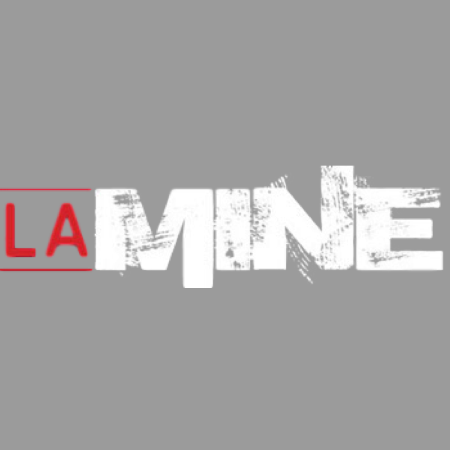
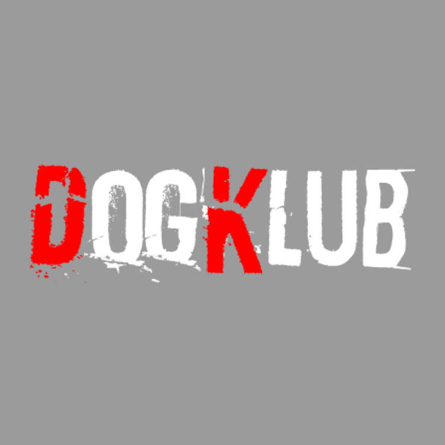
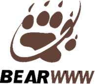

This year, the Luxembourg Bear Pride will be on October 18th - 20th in Luxembourg City. We are still looking to secure the several venues but we can give you already the schedule.

<a href="https://www.facebook.com/events/357291828163605/" class="ui facebook button"><i class="facebook icon"></i> Entire weekend event</a> <a href="#" class="ui disabled button"><i class="ticket alternate red icon"></i> Entire weekend pass (with discount) coming soon</a>

## Schedule

<h3>Friday 18th</h3>
    

        

            
Welcome Drink

            
6pm <i class="small building icon"></i> To be defined

            
The perfect time to get your week-end bracelet in exchange of your pre-sales.

        

    

    

        

            
Candidates presentation night

            
10pm <i class="small building icon"></i> To be defined

            

        

        

            

                <a href="https://www.facebook.com/events/357291828163605/" class="ui  button"><i class="facebook blue icon"></i> Event</a>
                <a href="#" class="ui disabled button"><i class="ticket alternate red icon"></i> No presales</a>
            

        

    

    <h3>Saturday 19th</h3>
    

        

            
LaserGame

            
2pm <a href="https://goo.gl/maps/UKzK9Ph7LvqVDefe6" class=""><i class="small building icon"></i> Laser Game Evolution</a> <i class="euro icon"></i>10-22

            

            
If you're more into fun games, we are suggesting to join other bears and go for a Lasergame all together. Everyone is paying for his own.

            
1 round 10&euro; · 2 rounds 17&euro; · 3 rounds 22&euro;

            
Please RSVP so we can accomodate the venue for you <i class="level down alternate icon"></i>

            

        

        

            

                <a href="https://www.facebook.com/events/2166587553451649/" class="ui button"><i class="facebook blue icon"></i> Event</a>
                <a href="https://thibault.typeform.com/to/WH2Btp" class="ui button">RSVP</a>
            

        

    

    

        

            
Mr. Bear Election night

            
9pm <a href="https://goo.gl/maps/CqjByh2eEZFSYMgy8" class=""><i class="small building icon"></i> The Room</a> <i class="euro icon"></i> incl.

            
This year, the election will take place at the venue of the Woof men-only party. Come starting at 9 to enjoy the music, the guys and vote to crown the new Mr Bear.

        

        

        

            <a href="https://www.facebook.com/events/497677773974918/" class="ui disabled button"><i class="facebook blue icon"></i> Event</a>
            <a href="https://tickets.bears.lu/e/22/woof-17-bear-pride-luxembourg-2019" class="ui button"><i class="ticket alternate red icon"></i> Tickets</a>
        

        

    

    

        

            
Woof Luxembourg Party

            
11pm <a href="https://goo.gl/maps/CqjByh2eEZFSYMgy8" class=""><i class="small building icon"></i> The Room</a> <i class="euro icon"></i>15

            

                <h5 class="ui grey heading">💪🏼 DADDi Europe x Woof Luxembourg 💪🏼</h5>

For the Bear Pride Luxembourg 2019, we are inviting DADDi® Europe to come in Luxembourg for our men-only party.

Then, with 2 new performers : Paco & Igor for a sexy show, and with the help of Hugo Jarocki & Dj José Sanchez, we'll gonna make you dance, cruse, drink, meet new people and have a great night with us.

            

        

        

            

                <a href="https://www.facebook.com/events/497677773974918/" class="ui button"><i class="facebook blue icon"></i> Event</a>
                <a href="https://tickets.bears.lu/e/22/woof-17-bear-pride-luxembourg-2019" class="ui button"><i class="ticket alternate red icon"></i> Tickets</a>
            

        

    

    <h3>Sunday 20th</h3>
    

        

            
City Tour (To be confirmed)

            
1pm

            
<i class="warning red icon"></i>We are still waiting answers from partners for this activities.

        

        

            

                <a href="" class="ui disabled button"><i class="facebook blue icon"></i> Event</a>
                <a href="#" class="ui disabled button">RSVP</a>
            

        

    

## Mr Bear Election

Want to be the next Mr Bear Luxembourg ?

<a href="https://forms.gle/qgskYjs1WU13GUid8" class="ui brown button">Fill the application form online</a>

## Sponsoring

    
    

We are always looking for sponsors and offering a wide range of compensation. You can checkout the [Sponsoring documentation](https://docs.google.com/document/d/e/2PACX-1vQJip54iVy5ryeDAR_27EH07-7hl0aUwIReRTd1Er0H7XNZhpztbgDvcnUJ3OLxNnvq-OxXTm6JtjRf/pub) to know everything about the metrics of the events, the differents sponsoring opportunities ...

#### Communication sponsors

    
    
    
    
    
    
    
    
    

<small>[Sponsoring T&C](https://docs.google.com/document/d/e/2PACX-1vRiHgdxO-wmB5S4NaAdCm4oLEZPC95LRDyx2kJgEE3jtC9QR11ku3sn3SXS03O47ErFz2byoaw7F3ky/pub)</small>

## Where to find ...

So, for the new ones as the bears who already know our lovely capital city, here's a map where we gather the venues of the evens, bars & restaurants we love, cool shops, nice art & culture venues and some usefull grocery shops and hotels in the city.

Don't miss our special partnership with Melia Luxembourg Hotel!

<i class="info circle blue icon"></i>click on the drawer symbol (1st icon on the title bar of the map) to show the menu with the categories.

<iframe src="https://www.google.com/maps/d/u/1/embed?mid=1Y5-12S01_kVDaGj8hVwH4rOFlIORfDgS" width="760" height="480" style="border:none"></iframe>
